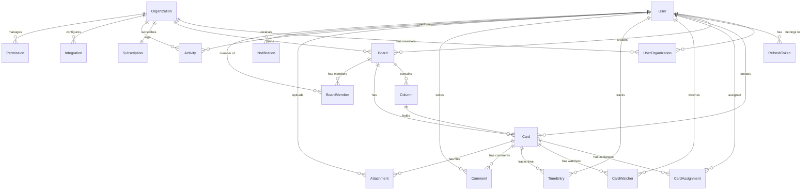

# Data Model: Enterprise Dashboard Development

**Feature**: 003-enterprise-dashboard-development  
**Date**: 2025-09-10  
**Database**: PostgreSQL with Prisma ORM (existing)

## Entity Relationship Overview



## Core Entities (Existing in Prisma Schema)

### User
Primary entity representing an authenticated user account.

| Field | Type | Constraints | Description |
|-------|------|-------------|-------------|
| id | String (UUID) | PRIMARY KEY | Unique identifier |
| email | String | UNIQUE, NOT NULL | Login email |
| passwordHash | String | NOT NULL | Bcrypt hashed password |
| firstName | String | NOT NULL | User's first name |
| lastName | String | NOT NULL | User's last name |
| name | String? | NULLABLE | Display name |
| company | String? | NULLABLE | Company name |
| avatar | String? | NULLABLE | Avatar image URL |
| bio | String? | NULLABLE | User biography |
| phone | String? | NULLABLE | Phone number |
| timezone | String | DEFAULT 'UTC' | User's timezone |
| language | String | DEFAULT 'en' | Preferred language |
| theme | String | DEFAULT 'light' | UI theme preference |
| emailVerified | Boolean | DEFAULT false | Email verification status |
| twoFactorEnabled | Boolean | DEFAULT false | 2FA status |
| twoFactorSecret | String? | NULLABLE | 2FA secret (encrypted) |
| twoFactorBackupCodes | String[] | | Backup codes for 2FA |
| lastLoginAt | DateTime? | NULLABLE | Last login timestamp |
| failedLoginAttempts | Int | DEFAULT 0 | Failed login counter |
| accountLocked | Boolean | DEFAULT false | Account lock status |
| role | String | DEFAULT 'USER' | System role |
| hourlyRate | Decimal? | NULLABLE | Billing rate |
| currency | String | DEFAULT 'USD' | Preferred currency |
| stripeCustomerId | String? | NULLABLE | Stripe integration |
| notificationPreferences | Json | DEFAULT '{}' | Notification settings |
| createdAt | DateTime | DEFAULT NOW() | Account creation |
| updatedAt | DateTime | @updatedAt | Last modification |
| deletedAt | DateTime? | NULLABLE | Soft delete timestamp |

**Indexes**: email, createdAt, deletedAt  
**Relations**: Multiple (organizations, boards, cards, etc.)

### Organization
Workspace containing boards and team members.

| Field | Type | Constraints | Description |
|-------|------|-------------|-------------|
| id | String (UUID) | PRIMARY KEY | Unique identifier |
| name | String | NOT NULL | Organization name |
| slug | String | UNIQUE, NOT NULL | URL-safe identifier |
| logo | String? | NULLABLE | Logo image URL |
| ownerId | String | FOREIGN KEY(User) | Organization owner |
| customDomain | String? | NULLABLE | White-label domain |
| settings | Json | DEFAULT '{}' | Organization settings |
| memberCount | Int | DEFAULT 1 | Cached member count |
| createdAt | DateTime | DEFAULT NOW() | Creation timestamp |
| updatedAt | DateTime | @updatedAt | Last modification |

**Indexes**: slug, ownerId  
**Relations**: Owner, Subscription, Boards, Members, Activities, Integrations

### Board
Project workspace containing cards organized in columns.

| Field | Type | Constraints | Description |
|-------|------|-------------|-------------|
| id | String (UUID) | PRIMARY KEY | Unique identifier |
| organizationId | String | FOREIGN KEY | Parent organization |
| name | String | NOT NULL | Board name |
| description | String? | NULLABLE | Board description |
| color | String | DEFAULT '#3B82F6' | Board color (hex) |
| icon | String? | NULLABLE | Board icon identifier |
| isPrivate | Boolean | DEFAULT false | Visibility setting |
| isArchived | Boolean | DEFAULT false | Archive status |
| position | Int | NOT NULL | Display order |
| settings | Json | DEFAULT '{}' | Board-specific settings |
| createdBy | String | FOREIGN KEY(User) | Creator |
| createdAt | DateTime | DEFAULT NOW() | Creation timestamp |
| updatedAt | DateTime | @updatedAt | Last modification |

**Indexes**: organizationId, isArchived, position  
**Relations**: Organization, Creator, Columns, Cards, Members

### Column
Workflow stage containing cards (e.g., To Do, In Progress, Done).

| Field | Type | Constraints | Description |
|-------|------|-------------|-------------|
| id | String (UUID) | PRIMARY KEY | Unique identifier |
| boardId | String | FOREIGN KEY(Board) | Parent board |
| name | String | NOT NULL | Column name |
| color | String? | NULLABLE | Column color |
| position | Int | NOT NULL | Display order |
| wipLimit | Int? | NULLABLE | Work-in-progress limit |
| isCollapsed | Boolean | DEFAULT false | UI collapse state |
| createdAt | DateTime | DEFAULT NOW() | Creation timestamp |
| updatedAt | DateTime | @updatedAt | Last modification |

**Unique**: [boardId, position]  
**Indexes**: boardId, position  
**Relations**: Board, Cards

### Card
Individual task or work item.

| Field | Type | Constraints | Description |
|-------|------|-------------|-------------|
| id | String (UUID) | PRIMARY KEY | Unique identifier |
| columnId | String | FOREIGN KEY(Column) | Current column |
| boardId | String | FOREIGN KEY(Board) | Parent board (denormalized) |
| title | String | NOT NULL | Card title |
| description | String? | NULLABLE | Card description |
| position | Int | NOT NULL | Order in column |
| priority | Priority | DEFAULT MEDIUM | Priority level |
| status | CardStatus | DEFAULT OPEN | Card status |
| dueDate | DateTime? | NULLABLE | Due date |
| startDate | DateTime? | NULLABLE | Start date |
| estimatedHours | Decimal? | NULLABLE | Time estimate |
| actualHours | Decimal | DEFAULT 0 | Actual time spent |
| labels | String[] | | Tags/labels |
| customFields | Json | DEFAULT '{}' | Custom field values |
| attachmentCount | Int | DEFAULT 0 | File count (cached) |
| commentCount | Int | DEFAULT 0 | Comment count (cached) |
| createdBy | String | FOREIGN KEY(User) | Creator |
| createdAt | DateTime | DEFAULT NOW() | Creation timestamp |
| updatedAt | DateTime | @updatedAt | Last modification |
| completedAt | DateTime? | NULLABLE | Completion timestamp |

**Unique**: [columnId, position]  
**Indexes**: columnId, boardId, status, dueDate, createdBy  
**Relations**: Column, Board, Creator, Assignments, Watchers, TimeEntries, Comments, Attachments

### TimeEntry
Time tracking record for a card.

| Field | Type | Constraints | Description |
|-------|------|-------------|-------------|
| id | String (UUID) | PRIMARY KEY | Unique identifier |
| cardId | String | FOREIGN KEY(Card) | Associated card |
| userId | String | FOREIGN KEY(User) | User who tracked time |
| startTime | DateTime | NOT NULL | Start timestamp |
| endTime | DateTime? | NULLABLE | End timestamp |
| duration | Int? | NULLABLE | Duration in seconds (cached) |
| description | String? | NULLABLE | Work description |
| isBillable | Boolean | DEFAULT true | Billable flag |
| isManual | Boolean | DEFAULT false | Manual vs timer entry |
| createdAt | DateTime | DEFAULT NOW() | Creation timestamp |
| updatedAt | DateTime | @updatedAt | Last modification |

**Indexes**: cardId, userId, startTime, isBillable  
**Relations**: Card, User

### Subscription
Organization subscription details.

| Field | Type | Constraints | Description |
|-------|------|-------------|-------------|
| id | String (UUID) | PRIMARY KEY | Unique identifier |
| organizationId | String | UNIQUE, FK | Organization |
| plan | Plan | ENUM | Subscription plan |
| status | SubscriptionStatus | ENUM | Current status |
| stripeCustomerId | String? | NULLABLE | Stripe customer |
| stripeSubscriptionId | String? | NULLABLE | Stripe subscription |
| currentPeriodStart | DateTime | NOT NULL | Billing period start |
| currentPeriodEnd | DateTime | NOT NULL | Billing period end |
| cancelAtPeriodEnd | Boolean | DEFAULT false | Cancellation flag |
| seats | Int | DEFAULT 1 | Licensed seats |
| features | Json | | Enabled features |
| usage | Json | DEFAULT '{}' | Usage metrics |
| createdAt | DateTime | DEFAULT NOW() | Creation timestamp |
| updatedAt | DateTime | @updatedAt | Last modification |

**Indexes**: status, stripeCustomerId  
**Relations**: Organization

### Comment
Discussion on cards.

| Field | Type | Constraints | Description |
|-------|------|-------------|-------------|
| id | String (UUID) | PRIMARY KEY | Unique identifier |
| cardId | String | FOREIGN KEY(Card) | Parent card |
| userId | String | FOREIGN KEY(User) | Author |
| content | String | NOT NULL | Comment text |
| mentions | String[] | | Mentioned user IDs |
| isEdited | Boolean | DEFAULT false | Edit flag |
| editedAt | DateTime? | NULLABLE | Edit timestamp |
| createdAt | DateTime | DEFAULT NOW() | Creation timestamp |

**Indexes**: cardId, userId, createdAt  
**Relations**: Card, User

### Attachment
Files attached to cards.

| Field | Type | Constraints | Description |
|-------|------|-------------|-------------|
| id | String (UUID) | PRIMARY KEY | Unique identifier |
| cardId | String | FOREIGN KEY(Card) | Parent card |
| uploadedBy | String | FOREIGN KEY(User) | Uploader |
| fileName | String | NOT NULL | File name |
| fileSize | BigInt | NOT NULL | Size in bytes |
| mimeType | String | NOT NULL | MIME type |
| url | String | NOT NULL | Storage URL |
| thumbnailUrl | String? | NULLABLE | Thumbnail URL |
| createdAt | DateTime | DEFAULT NOW() | Upload timestamp |

**Indexes**: cardId, uploadedBy  
**Relations**: Card, Uploader

### Activity
Audit log for all actions.

| Field | Type | Constraints | Description |
|-------|------|-------------|-------------|
| id | String (UUID) | PRIMARY KEY | Unique identifier |
| userId | String | FOREIGN KEY(User) | Actor |
| organizationId | String | FOREIGN KEY | Organization context |
| entityType | String | NOT NULL | Entity type (Board, Card, etc.) |
| entityId | String | NOT NULL | Entity ID |
| action | String | NOT NULL | Action performed |
| changes | Json? | NULLABLE | Change details |
| ipAddress | String? | NULLABLE | Client IP |
| userAgent | String? | NULLABLE | Client user agent |
| createdAt | DateTime | DEFAULT NOW() | Action timestamp |

**Indexes**: userId, organizationId, [entityType, entityId], createdAt  
**Relations**: User, Organization

### Report
Generated analytics and reports.

| Field | Type | Constraints | Description |
|-------|------|-------------|-------------|
| id | String (UUID) | PRIMARY KEY | Unique identifier |
| organizationId | String | NOT NULL | Organization |
| createdBy | String | NOT NULL | Creator |
| type | String | NOT NULL | Report type |
| name | String | NOT NULL | Report name |
| parameters | Json | NOT NULL | Report parameters |
| data | Json? | NULLABLE | Cached data |
| format | String | NOT NULL | Output format |
| isScheduled | Boolean | DEFAULT false | Scheduled flag |
| schedule | String? | NULLABLE | Cron schedule |
| lastRunAt | DateTime? | NULLABLE | Last execution |
| createdAt | DateTime | DEFAULT NOW() | Creation timestamp |

**Indexes**: organizationId, type, isScheduled  
**No direct relations** (references via IDs)

### Integration
Third-party service connections.

| Field | Type | Constraints | Description |
|-------|------|-------------|-------------|
| id | String (UUID) | PRIMARY KEY | Unique identifier |
| organizationId | String | FOREIGN KEY | Organization |
| provider | String | NOT NULL | Service name |
| isActive | Boolean | DEFAULT true | Active flag |
| config | Json | NOT NULL | Configuration |
| webhookUrl | String? | NULLABLE | Webhook endpoint |
| lastSyncAt | DateTime? | NULLABLE | Last sync time |
| createdAt | DateTime | DEFAULT NOW() | Creation timestamp |
| updatedAt | DateTime | @updatedAt | Last modification |

**Indexes**: organizationId, provider, isActive  
**Relations**: Organization

### Notification
User notifications.

| Field | Type | Constraints | Description |
|-------|------|-------------|-------------|
| id | String (UUID) | PRIMARY KEY | Unique identifier |
| userId | String | FOREIGN KEY(User) | Recipient |
| type | String | NOT NULL | Notification type |
| title | String | NOT NULL | Title |
| message | String | NOT NULL | Message body |
| data | Json? | NULLABLE | Additional data |
| isRead | Boolean | DEFAULT false | Read status |
| readAt | DateTime? | NULLABLE | Read timestamp |
| channel | String | DEFAULT 'app' | Delivery channel |
| createdAt | DateTime | DEFAULT NOW() | Creation timestamp |

**Indexes**: userId, isRead, type, createdAt  
**Relations**: User

### Permission
Role-based access control.

| Field | Type | Constraints | Description |
|-------|------|-------------|-------------|
| id | String (UUID) | PRIMARY KEY | Unique identifier |
| userId | String | FOREIGN KEY(User) | User |
| organizationId | String | FOREIGN KEY | Organization |
| resourceType | String | NOT NULL | Resource type |
| resourceId | String? | NULLABLE | Specific resource |
| role | String | NOT NULL | Role name |
| permissions | String[] | | Permission list |
| grantedBy | String | FOREIGN KEY(User) | Granter |
| expiresAt | DateTime? | NULLABLE | Expiration |
| createdAt | DateTime | DEFAULT NOW() | Grant timestamp |

**Indexes**: userId, organizationId, [resourceType, resourceId]  
**Relations**: User, Organization, Granter

## Join Tables

### UserOrganization
Many-to-many relationship between users and organizations.

| Field | Type | Constraints | Description |
|-------|------|-------------|-------------|
| userId | String | FOREIGN KEY(User) | User ID |
| organizationId | String | FOREIGN KEY(Org) | Organization ID |
| role | OrganizationRole | ENUM | User's role |
| joinedAt | DateTime | DEFAULT NOW() | Join timestamp |

**Primary Key**: [userId, organizationId]  
**Relations**: User, Organization

### CardAssignment
Users assigned to cards.

| Field | Type | Constraints | Description |
|-------|------|-------------|-------------|
| cardId | String | FOREIGN KEY(Card) | Card ID |
| userId | String | FOREIGN KEY(User) | Assignee ID |
| assignedAt | DateTime | DEFAULT NOW() | Assignment time |
| assignedBy | String | NOT NULL | Assigner ID |

**Primary Key**: [cardId, userId]  
**Relations**: Card, User

### CardWatcher
Users watching cards for updates.

| Field | Type | Constraints | Description |
|-------|------|-------------|-------------|
| cardId | String | FOREIGN KEY(Card) | Card ID |
| userId | String | FOREIGN KEY(User) | Watcher ID |
| watchedAt | DateTime | DEFAULT NOW() | Watch start time |

**Primary Key**: [cardId, userId]  
**Relations**: Card, User

### RefreshToken
JWT refresh tokens for authentication.

| Field | Type | Constraints | Description |
|-------|------|-------------|-------------|
| id | String (UUID) | PRIMARY KEY | Unique identifier |
| token | String | UNIQUE | Token value |
| userId | String | FOREIGN KEY(User) | User |
| expiresAt | DateTime | NOT NULL | Expiration |
| revokedAt | DateTime? | NULLABLE | Revocation time |
| createdAt | DateTime | DEFAULT NOW() | Creation time |

**Indexes**: userId, token, expiresAt  
**Relations**: User

### BoardMember
Board membership and permissions.

| Field | Type | Constraints | Description |
|-------|------|-------------|-------------|
| id | String (UUID) | PRIMARY KEY | Unique identifier |
| boardId | String | FOREIGN KEY(Board) | Board |
| userId | String | FOREIGN KEY(User) | Member |
| role | String | DEFAULT 'VIEWER' | Board role |
| joinedAt | DateTime | DEFAULT NOW() | Join time |

**Unique**: [boardId, userId]  
**Indexes**: boardId, userId  
**Relations**: Board, User

## Enums

### Priority
```typescript
enum Priority {
  LOW
  MEDIUM
  HIGH
  URGENT
}
```

### CardStatus
```typescript
enum CardStatus {
  OPEN
  IN_PROGRESS
  BLOCKED
  DONE
}
```

### Plan
```typescript
enum Plan {
  FREE
  PRO
  ENTERPRISE
}
```

### SubscriptionStatus
```typescript
enum SubscriptionStatus {
  TRIAL
  ACTIVE
  PAST_DUE
  CANCELED
}
```

### OrganizationRole
```typescript
enum OrganizationRole {
  OWNER
  ADMIN
  MEMBER
  VIEWER
}
```

## Data Integrity Rules

1. **Cascade Deletes**:
   - Organization deletion → cascades to Boards
   - Board deletion → cascades to Columns and Cards
   - Card deletion → cascades to TimeEntries, Comments, Attachments
   - User deletion → keeps data but anonymizes

2. **Position Management**:
   - Column positions unique per board
   - Card positions unique per column
   - Reordering updates all affected positions

3. **Cached Counts**:
   - Card.attachmentCount updated on attachment changes
   - Card.commentCount updated on comment changes
   - Organization.memberCount updated on member changes
   - Card.actualHours sum of TimeEntry durations

4. **Audit Trail**:
   - All changes logged to Activity table
   - Soft deletes with deletedAt timestamp
   - Change history in Activity.changes JSON

5. **Data Validation**:
   - Email uniqueness enforced
   - Slug uniqueness per organization
   - Hex color validation for colors
   - URL validation for domains and webhooks

## Performance Considerations

1. **Indexes**:
   - All foreign keys indexed
   - Composite indexes for common queries
   - Partial indexes for soft deletes

2. **Denormalization**:
   - Card.boardId for direct board queries
   - Cached counts to avoid aggregations
   - User name fields for display

3. **JSON Fields**:
   - Settings for flexible configuration
   - Custom fields for extensibility
   - Notification preferences

4. **Query Optimization**:
   - Eager loading for related data
   - Pagination for large datasets
   - Cursor-based pagination for real-time

---
*Data model based on existing Prisma schema at `/prisma/schema.prisma`*